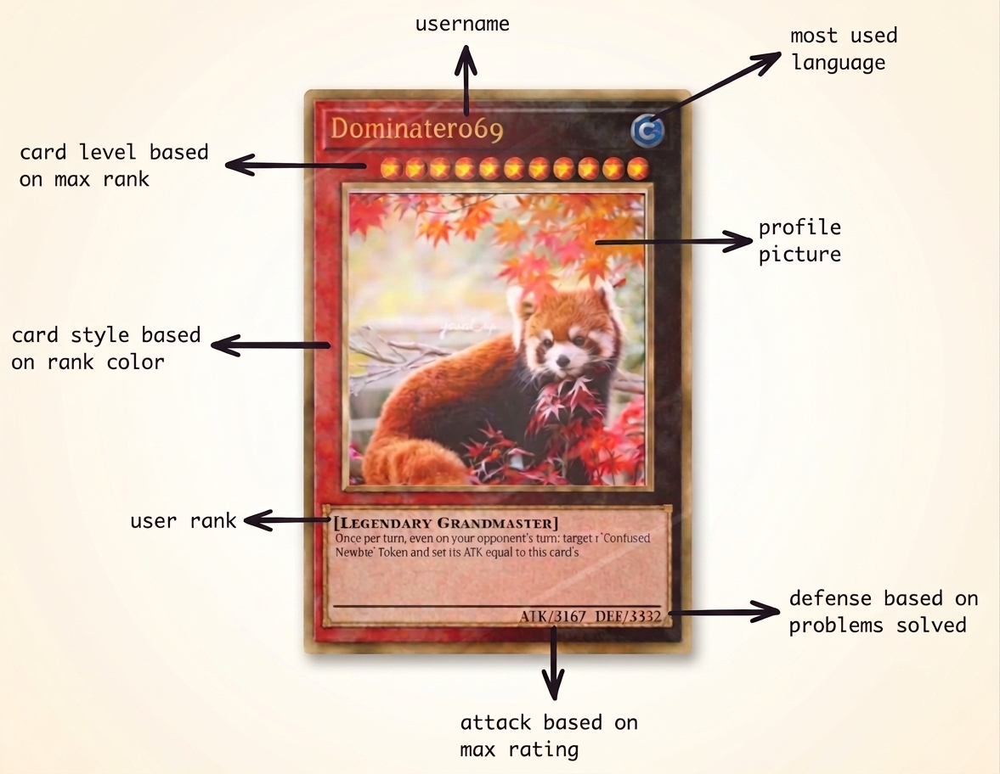
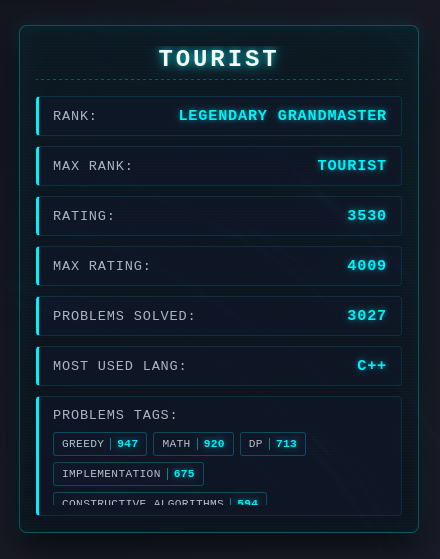
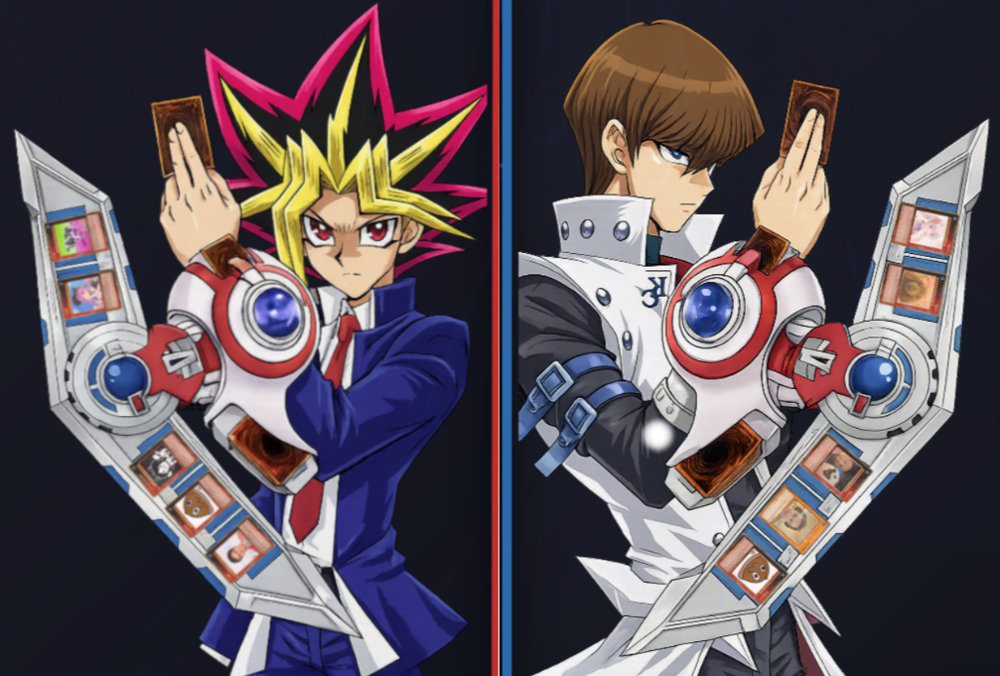
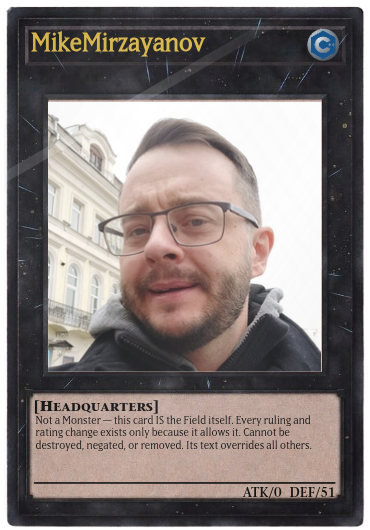
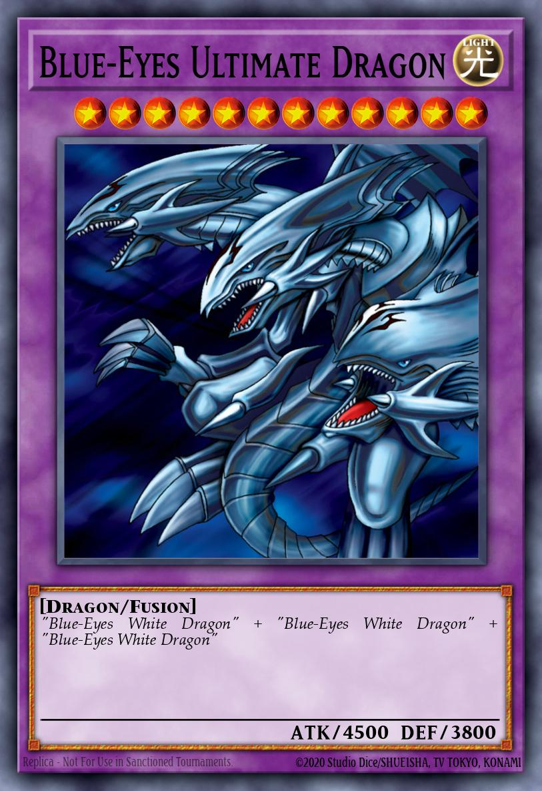

<h1 style="margin:0;">
  
  <span style="vertical-align:middle; margin-bottom: 10px;">Yu-Gi-Oh Codeforces Stats</span>
</h1>


<p align="center">
  
</p>
  Welcome to the documentation of Yu-Gi-Oh Codeforces Stats — a web application that converts your <a href="https://codeforces.com" target="_blank" rel="noopener noreferrer">Codeforces</a> user into a Yu-Gi-Oh card based on your problem-solving skills.

## Table of Contents
- [Usage](#usage)
    - [Run locally](#run-locally)
- [Frontend](#frontend)
  - [Cards](#cards)
  - [Card screenshot](#card-screenshot)
  - [Card stats panel](#card-stats-panel)
  - [Match Card](#match-card)
  - [World Tops](#world-tops)
- [Backend](#backend)
  - [API](#api)
  - [Endpoints](#endpoints)
  - [Web Scrapping](#web-scrapping)
    - [Headquarters](#headquarters)
    - [Badges](#badges)
  - [Database](#database)
  - [Codeforces to Yu-Gi-Oh! Monster Mapper](#codeforces-to-yu-gi-oh-monster-mapper)
- [Credits](#credits)


## Usage
Live demo: https://yu-gi-oh-codeforces-stats.vercel.app/

### Run locally

This project is a React application written in TypeScript and bundled by Vite. The frontend expects JSON endpoints served by the backend (FastAPI). Follow the steps below to run the app locally with the frontend served exactly at `localhost:5173` so the backend CORS rules permit requests.

Prerequisites

- Node.js 18+ and `npm` (or `pnpm` / `yarn`) installed for the frontend.


#### Install frontend dependencies and run Vite on `localhost:5173`:

```bash
# From the repository root
npm install
# Start Vite dev server bound to localhost on port 5173 (ensures origin is exactly http://localhost:5173)
npm run dev -- --host localhost --port 5173
# Open http://localhost:5173
```

Notes:
- Running Vite with `--host localhost` guarantees the dev server origin is `http://localhost:5173` (not `0.0.0.0` or an IP), which matches the backend CORS allow list.


## Frontend

<p>
  
  
  
</p>
This section describes the frontend application that renders interactive Yu-Gi-Oh style cards, manages user interactions, and fetches data from the backend API.

### Cards
<p align="center">
  
</p>

Codeforces users are modeled as Yu-Gi-Oh style cards based on their problem-solving skills and contest participation. The user statistics determine the card numeric stats, template color, and other visual elements.

<p align="center">
  
</p>

The correspondences are:

- **Attack:** `max rating` — the highest rating the user has achieved on Codeforces.
- **Defense:** `problems solved` — total number of problems the user has solved.
- **Attribute:** `most-used programming language` — the language the user most commonly uses to solve problems.
- **Card template color:** `rank` — the user's current Codeforces rank (used to color the card template).
- **Card type:** `rank` — the user's current rank used to determine the card type.
- **Card level:** `max rank` — the user's maximum rank represented as a level (stars) on the card.

As a card's rank increases, additional animations and visual effects (for example: glow, animated borders, and particle accents) are applied to emphasize rarity and achievement.

### Card screenshot

Users can capture a styled image of any generated card. This uses the `html2canvas` library to render the card element to a downloadable image.

### Card stats panel

The sidebar panel displays the user's main profile statistics, including the types of problems solved (for example: Algorithms, Data Structures, Math) along with counts for each type. Example below:

<p align="center">
  
</p>

### Match Card

A "flip" button is placed next to the screenshot/download button in the card UI. When the user presses this button the frontend requests a Yu-Gi-Oh card image and displays it to the user; the backend is responsible for selecting and mapping the appropriate card using the [YGOPRODeck API](https://ygoprodeck.com). See the [Backend](#backend) section for selection details.

### World Tops

<p align="center">
  
</p>
<p align="center"><em>The sprites shown in the photo have, in their Duel Disk, the cards corresponding to the top 5 places of the world top in rating and contribution respectively.</em></p>

The app includes a dedicated section that displays the world top lists: a leaderboard of top-rated users and a leaderboard of top contributors. These lists are populated from cached backend endpoints.
## Backend

<p>
  
  
  
</p>

Backend attribution — This backend was implemented by the other project collaborator [10Y6](https://github.com/10Y6). 

This section documents the backend API and core data flow. The backend collects data from the Codeforces API and from per-user profile scraping, enriches and persists user records in a local SQLite database, maintains lightweight JSON caches for top lists under `app/cache/`, and exposes endpoints consumed by the frontend.

### API

The backend exposes a small HTTP JSON API implemented with `FastAPI` (see `backend/app/main.py`). It uses an asynchronous application lifecycle to create shared HTTP clients for external requests and runs several endpoints and background tasks to collect, enrich and serve Codeforces user data.

- Framework: `FastAPI` with async endpoints and background tasks.
- Shared resources: an `httpx.AsyncClient` is initialized during the app lifespan for external API calls.
- Data model: `User` records are persisted via `backend/app/database.py` using `SQLModel` and SQLite.
- Enrichment flow: endpoints call `backend/app/services.py` to fetch Codeforces API data, scrape profile pages when needed, compute solved problems/tags/most-used-language, and extract badges.
- Caching: lightweight JSON caches are stored under `backend/app/cache/` and refreshed by `POST /update_tops_cache` and `POST /update_base_info` background tasks.

The API returns JSON responses consumable by the frontend; the most important routes are listed below.

### Endpoints

- `GET /user.info?handle={handle}` — Returns an enriched `User` JSON for the requested Codeforces handle. Flow: check local DB (`database.get_user_info_db`); if missing, call `services.get_individual_info` to fetch from the Codeforces API, then `services.scrap_info` to compute solved problems, tags, most-used language and badges, update the DB (`database.update_database`) and caches as needed. (See `backend/app/main.py` → `user_info`.)

- `GET /tops` — Returns the cached top lists `{ top_rated, top_contributors }` read from `app/cache/top10_rated_cache.json` and `app/cache/top10_contributors_cache.json`. The values are produced by `services.get_top10_rated` and `services.get_top10_contr` (cached mode). (See `backend/app/main.py` → `get_tops`.)

- `POST /update_tops_cache` — Triggers an asynchronous background task that rebuilds the top-10 caches: it scrapes the site for top handles, resolves each handle to a full `User` (using the same `user_info` flow) and writes the resulting arrays to `app/cache/*.json`. Useful for manual cache refresh. (See `backend/app/main.py` → `trigger_cache_uptade` / `update_tops_cache`.)

- `POST /update_base_info` — Triggers a background update that downloads the global rated list from Codeforces (`user.ratedList`), constructs `User` entries and updates the local database. Intended for periodic full-sync operations. (See `backend/app/main.py` → `trigger_codeforces_api_info` / `codeforces_api_info`.)

- `GET /health` — Lightweight healthcheck endpoint returning `{'status':'ok'}`.

More detailed behavior, caching and update strategies are documented in the roadmap and service code (`backend/app/services.py`, `backend/app/database.py`, `backend/app/utils.py`).

### Web Scrapping
The backend performs targeted web scraping to fill gaps and enrich user profiles. Scraping is implemented using `curl_cffi.AsyncSession` for HTTP requests (see `backend/app/services.py`). Scraping usages are described below

#### Headquarters
<p align="center">
  
</p>

The `process_null_rated` scraper targets the profile UI to recover ranking data when the Codeforces API response is incomplete. It specifically reads the `div.user-rank` and nearby `ul li` elements to compute `rank` and `max_rank`; these values are normalized and stored in the DB. One effect of this scraping is to correctly detect and persist special rank labels used on Codeforces (for example `headquarters`), so the frontend can map such users to the special `Headquarters` card template and description.

#### Badges

<p align="center">
  
  
  
</p>
These badges are awarded to users for long tenure on the platform and are displayed in the bottom-right corner of the user's avatar on the card.

Badge images are scraped from the user's Codeforces profile page and stored as image URLs on the `User.badges` JSON field. In the frontend these badges are displayed on the user's card (bottom-right of the avatar). See `services.get_badges` for the scraping implementation.

### Codeforces to Yu-Gi-Oh! Monster Mapper

<div style="display:flex; justify-content:center; gap:16px; margin:18px 0;">
  
  
</div>
<p align="center"><em>The card corresponding to the user Maspy and its equivalent in the Yu-Gi-Oh! universe.</em></p>

The `most_close_card` function maps a Codeforces user's competitive profile to the most fitting Yu-Gi-Oh! monster card. It translates competitive statistics into monster attributes—**ATK**, **DEF**, **Level/Rank**, and **Race**—and evaluates candidate cards using a weighted Euclidean distance algorithm to find the closest match.

---

#### Stat Conversion Logic

1. **Attack (ATK):** Derived directly from the user's highest Codeforces rating (`maxRating`):
   $$\text{Target ATK} = \lfloor \text{maxRating} \times 1.25 \rfloor$$

2. **Defense (DEF):** Scaled using the square root of total solved problems (`solvedProblems`) to avoid runaway growth while rewarding persistence, capped at 4000:
   $$\text{Target DEF} = \min\left(\lfloor \sqrt{\text{solvedProblems}} \times 36.5 \rfloor, 4000\right)$$

3. **Level / Rank:** Mapped directly from the user's highest rank (`maxRank`) on a 1-to-12 scale (e.g., *Newbie* = Level 1, *Master* = Level 7, *Legend / Tourist / Jiangly* = Level 12).

4. **Monster Type (Race):** Assigned based on the user's **dominant tag**, determined by multiplying problem counts by custom difficulty weights (e.g., `dp` $\rightarrow$ *Wyrm*, `math` $\rightarrow$ *Spellcaster*, `graphs` $\rightarrow$ *Thunder*, `data structures` $\rightarrow$ *Cyberse*).

---

#### Tag → Monster mapping

| Tag | Monster Race |
|---|---|
| implementation | Warrior |
| brute force | Beast |
| greedy | Fiend |
| math | Spellcaster |
| number theory | Spellcaster |
| combinatorics | Fairy |
| fft | Psychic |
| data structures | Cyberse |
| trees | Plant |
| bitmasks | Zombie |
| string suffix structures | Dragon |
| graphs | Thunder |
| dfs and similar | Insect |
| shortest paths | Winged Beast |
| geometry | Machine |
| binary search | Rock |
| two pointers | Aqua |
| constructive algorithms | Pyro |
| dp | Wyrm |
| sortings | Sea Serpent |


#### Candidate Selection & Matching Algorithm

**Candidate Filtering:**

- **Standard Users ($\text{Level} < 10$):** Searches exclusively within monsters matching the user's assigned $Race$.
- **Elite Users ($\text{Level} \ge 10$):** Expands the pool to any high-tier boss monster ($\text{Level} \ge 10$) regardless of $Race$, ensuring high-ranking competitors receive legendary cards.

**Weighted Distance Calculation:**

The algorithm normalizes differences across $ATK$, $DEF$, and $Level$, computing a weighted Euclidean distance to identify the closest matching card:

$$\text{Distance} = \sqrt{0.55 \cdot (\Delta \text{ATK}_{\text{norm}})^2 + 0.25 \cdot (\Delta \text{DEF}_{\text{norm}})^2 + 0.20 \cdot (\Delta \text{Level}_{\text{norm}})^2}$$

- **55% Weight on ATK:** Emphasizes peak competitive rating.
- **25% Weight on DEF:** Rewards problem-solving volume.
- **20% Weight on Level:** Aligns the card with the user's rank tier.

**Tie-Breaking:** If two cards have the exact same distance score, the card with the lower internal card ID is chosen as a deterministic fallback.

### Database

The application uses a local SQLite database managed through `SQLModel` (a thin layer on top of `SQLAlchemy`). The connection is created with the URL `sqlite:///database/codeforces.db` in `backend/app/database.py` and a shared `engine` is exposed.

- Creation: `create_database()` calls `SQLModel.metadata.create_all(engine)` to ensure the `User` model tables exist.
- Write/update: `update_database(users: list[User])` opens a `Session(engine)` and calls `session.merge(user)` for each entry —this behaves as an "upsert" (insert or update based on the primary key `handle`). It then calls `session.commit()` and closes the session.
- Read: `get_user_info_db(handle)` runs `select(User).where(func.lower(User.handle) == handle.lower())` to fetch the record by `handle` (case-insensitive).

Calls to `update_database` originate in the enrichment flow inside `backend/app/services.py` and in synchronization tasks (for example, `POST /update_base_info`) that rebuild or refresh the database with data from the Codeforces API and profile scraping.

## Credits

#### Backend author:

<table border="0" cellpadding="0" cellspacing="0" style="border:none;">
  <tr>
    <td valign="middle" style="border:none; padding:0 12px 0 0;">
      
    </td>
    <td valign="middle" style="border:none; padding:0;">
      <strong><a href="https://github.com/10Y6" target="_blank" rel="noopener noreferrer">10Y6</a></strong><br/>
      Co-author / Data Scientist
    </td>
  </tr>
</table>

External APIs and services used:

- Codeforces API — <https://codeforces.com/api>
- YGOPRODeck API — <https://ygoprodeck.com>

#### If you enjoyed this repository, please give it a star ⭐